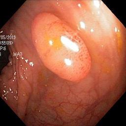
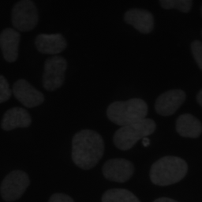
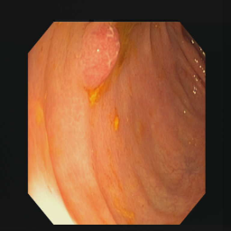

# FE-Net: Biomedical image segmentation for efficient segmentation
This is the official implementation for above paper.

## Requirements
* torch == 1.13.1
* tensorboard == 2.11.2
* ...

## Datasets
All datasets used in paper are public, you can download online

Split the datasets for train, validation and test

## Results

| Dataset\Type       | Original image           | GT           |  Prediction           |
|---------------|----------------|----------------|----------------|
| Kvasir-SEG           |  |  |  |
| DSB 2018           |  |  |  |
| CVC-clinicDB           |  |  |  |
